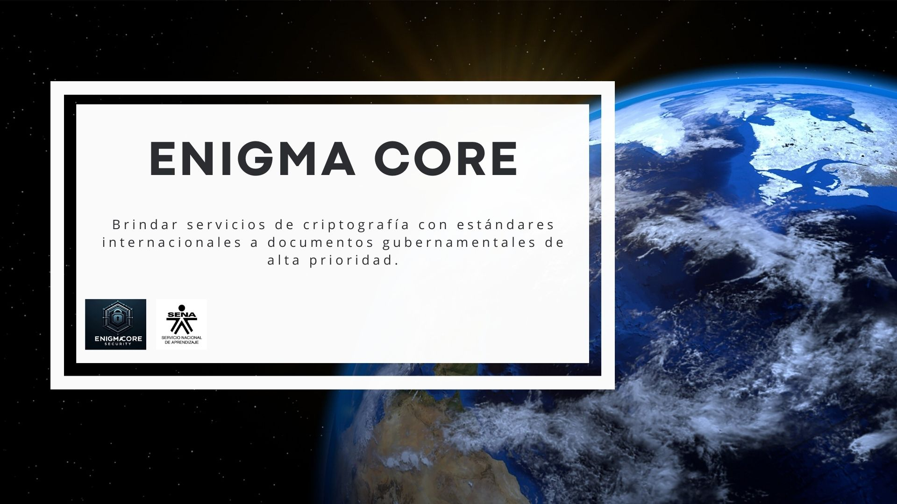

## 🚀 EnigmaCore

## 📜 Descripción
Dadas las nuevas fronteras cibernéticas la seguridad de la nación es un
problema crucial, mantener la seguridad, disponibilidad e integridad de la
información es la prioridad de muchos organismos internacionales. pensar Para
el desarrollo de la entrevista nos vimos sometidos a la problemática de ¿Cómo
generar un buen cifrado de la información? ¿Cómo mantener la
confidencialidad de la información gubernamental?


## 🛠️ Tecnologías

- **C++**: Lenguaje de programación principal utilizado para desarrollar la lógica de la aplicación.
- **PHP**: Lenguaje utilizado para el diseño de la página.
- **Docker**: Herramienta para crear contenedores que aseguran que la aplicación funcione de manera consistente en
  diferentes entornos.
- **Docker Compose**: Utilizado para definir y ejecutar aplicaciones Docker de múltiples contenedores, facilitando la
  gestión de servicios relacionados.
- **OpenSSL**: Biblioteca utilizada para implementar funciones de criptografía y seguridad en la aplicación.
- **Cmake**: Extensión utilizada para empaquetar el proyecto.
- **Xampp**: Gestior de bases de datos de código abierto.


## 📁 Estructura del Proyecto

 ```text
   /EnigmaCore
├── app.exe
├── Documento
    └── link
├── Dockerfile
├── docker-compose.yml
├── README.md
├── presentación
    └── link
├── video
│   └── video.mp4
└── data
    └── EnigmaCore
└── main.cpp
   ```
**📃 Documento:**
[link](https://docs.google.com/document/d/17Q_wMtWoGRQzrjcpVewf-du65nq7mJU-/edit?usp=sharing&ouid=116668543162587748605&rtpof=true&sd=true)


**📊 Presentación:**
[link](https://www.canva.com/design/DAGMUxQby0g/3zOM52Z05uOhtF1ILfYg0g/view?utm_content=DAGMUxQby0g&utm_campaign=designshare&utm_medium=link&utm_source=editor)

**🚀 Instalación:**

**Clonar el repositorio:**

   ```bash
   git clone https://github.com/JaiderSe/EnigmaCore.git
   ```

Redirigir al directorio del proyecto:

   ```bash
   cd EnigmaCore
   ```

## Compilar el Código

Compila el código fuente utilizando el compilador C++ y las bibliotecas de OpenSSL. Asegúrate de que el archivo main.cpp
esté en el directorio actual:

   ```bash
   g++ -o app src/main.cpp -lssl -lcrypto
   ```

## 🖥️ Ejecutar la Aplicación

Ejecuta la aplicación compilada. Asegúrate de que el archivo 5.NEF esté presente en el directorio data:

  ```bash
    ./app <operation> <input_path> <output_path>
  ```

o

 ```bash
    app <operation> <input_path> <output_path>
  ```

Ejemplo de uso para encriptar:

 ```bash
./app encrypt data/5.NEF data/encrypt/image_encrypted.bin
 ```

o

 ```bash
app encrypt data/5.NEF data/encrypt/image_encrypted.bin
 ```

Ejemplo de uso para desencriptar:

  ```bash
  ./app decrypt data/encrypt/image_encrypted.bin data/decrypt/image_decrypted.NEF
  ```

o

  ```bash
  app decrypt data/encrypt/image_encrypted.bin data/decrypt/image_decrypted.NEF
  ```

## 👥 Participantes


JAIDER SEBASTIAN MORENO QUINTERO <jaider_smoreno@soy.sena.edu.co>

JUAN SEBASTIAN MARTINEZ PINTO <sebaspinto96@gmail.com>

MICHACEL STEVEN SALAMANCA MARTIN <salamancamai12@gmail.com>

NICOLAS MARTINEZ VALENZUELA <nicomav1101023@gmail.com>

PAULA ANDREA CASSIANI CASTILLO <paulaacassiani@gmail.com>


